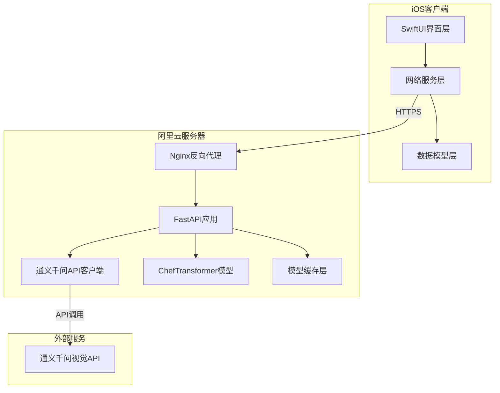

# 设计文档

## 概述

AI菜谱应用是一个前后端分离的移动应用系统，前端使用SwiftUI构建iOS客户端，后端使用FastAPI框架构建Python服务，集成通义千问视觉模型API和ChefTransformer模型。系统通过Docker容器化部署到阿里云Linux服务器，为用户提供智能菜谱推荐和烹饪指导服务。

整体架构采用客户端-服务器模式，iOS应用通过HTTPS与后端API通信，后端服务负责模型推理和业务逻辑处理。

## 架构

### 系统架构图



### 技术栈

**前端 (iOS)**
- SwiftUI - UI框架
- Combine - 响应式编程
- URLSession - 网络请求
- Swift Concurrency (async/await) - 异步处理

**后端 (Python)**
- FastAPI - Web框架
- Uvicorn - ASGI服务器
- Pydantic - 数据验证
- httpx - HTTP客户端（调用通义千问API）
- transformers - ChefTransformer模型加载
- torch - 深度学习框架
- Pillow - 图片处理

**部署**
- Docker - 容器化
- Docker Compose - 容器编排
- Nginx - 反向代理和负载均衡
- 阿里云ECS - Linux服务器

## 组件和接口

### iOS客户端组件

#### 1. ChatView (对话视图)
主界面组件，显示消息列表和输入区域。

**职责:**
- 渲染消息列表
- 处理用户输入
- 管理滚动行为
- 触发图片选择

**接口:**
```swift
struct ChatView: View {
    @StateObject private var viewModel: ChatViewModel
    var body: some View
}
```

#### 2. ChatViewModel (对话视图模型)
管理对话状态和业务逻辑。

**职责:**
- 维护消息列表
- 调用网络服务
- 处理用户操作
- 管理加载状态

**接口:**
```swift
class ChatViewModel: ObservableObject {
    @Published var messages: [Message]
    @Published var isLoading: Bool
    @Published var errorMessage: String?
    
    func sendTextMessage(_ text: String) async
    func sendImageMessage(_ image: UIImage) async
}
```

#### 3. APIService (API服务)
封装所有后端API调用。

**职责:**
- 发送HTTP请求
- 处理响应和错误
- 管理认证令牌
- 实现重试逻辑

**接口:**
```swift
class APIService {
    func sendTextQuery(_ text: String) async throws -> RecipeResponse
    func uploadImage(_ imageData: Data) async throws -> VisionResponse
    func checkHealth() async throws -> HealthStatus
}
```

#### 4. Message (消息模型)
表示单条聊天消息。

**数据结构:**
```swift
struct Message: Identifiable {
    let id: UUID
    let content: String
    let isUser: Bool
    let timestamp: Date
    let imageData: Data?
}
```

### 后端服务组件

#### 1. FastAPI应用主模块
定义API路由和中间件。

**路由:**
- `POST /api/chat/text` - 文本查询
- `POST /api/chat/image` - 图片识别
- `GET /api/health` - 健康检查

**中间件:**
- CORS中间件
- 请求日志中间件
- 错误处理中间件

#### 2. QwenVisionClient (通义千问客户端)
封装通义千问视觉API调用。

**职责:**
- 调用通义千问API
- 处理图片编码
- 解析识别结果
- 管理API密钥

**接口:**
```python
class QwenVisionClient:
    async def recognize_image(self, image_bytes: bytes) -> VisionResult:
        """识别图片中的食材或菜品"""
        pass
    
    async def analyze_ingredients(self, image_bytes: bytes) -> List[str]:
        """分析图片中的食材列表"""
        pass
```

#### 3. ChefTransformerService (菜谱生成服务)
使用ChefTransformer模型生成菜谱。

**职责:**
- 加载和管理模型
- 生成菜谱内容
- 格式化输出
- 实现缓存机制

**接口:**
```python
class ChefTransformerService:
    def __init__(self, model_path: str):
        """初始化模型"""
        pass
    
    async def generate_recipe(
        self, 
        dish_name: str, 
        ingredients: Optional[List[str]] = None
    ) -> Recipe:
        """生成菜谱"""
        pass
```

#### 4. 数据模型 (Pydantic Models)

**请求模型:**
```python
class TextQueryRequest(BaseModel):
    message: str
    conversation_id: Optional[str] = None

class ImageUploadRequest(BaseModel):
    # 使用multipart/form-data
    pass
```

**响应模型:**
```python
class Recipe(BaseModel):
    dish_name: str
    ingredients: List[Ingredient]
    steps: List[CookingStep]
    cooking_time: int
    difficulty: str

class Ingredient(BaseModel):
    name: str
    amount: str
    unit: str

class CookingStep(BaseModel):
    step_number: int
    description: str
    duration: Optional[int]

class APIResponse(BaseModel):
    success: bool
    data: Optional[Dict]
    error: Optional[str]
    message: str
```

## 数据模型

### iOS客户端数据模型

```swift
// 消息类型
enum MessageType {
    case text(String)
    case image(UIImage)
    case recipe(RecipeData)
}

// 消息实体
struct Message: Identifiable, Codable {
    let id: UUID
    let content: String
    let isUser: Bool
    let timestamp: Date
    let imageData: Data?
    let recipeData: RecipeData?
}

// 菜谱数据
struct RecipeData: Codable {
    let dishName: String
    let ingredients: [Ingredient]
    let steps: [CookingStep]
    let cookingTime: Int
    let difficulty: String
}

struct Ingredient: Codable {
    let name: String
    let amount: String
    let unit: String
}

struct CookingStep: Codable {
    let stepNumber: Int
    let description: String
    let duration: Int?
}

// API响应
struct APIResponse<T: Codable>: Codable {
    let success: Bool
    let data: T?
    let error: String?
    let message: String
}
```

### 后端数据模型

```python
# 数据库模型（如果需要持久化）
from sqlalchemy import Column, String, Integer, DateTime, Text
from sqlalchemy.ext.declarative import declarative_base

Base = declarative_base()

class ConversationHistory(Base):
    __tablename__ = "conversations"
    
    id = Column(String, primary_key=True)
    user_id = Column(String, index=True)
    message = Column(Text)
    response = Column(Text)
    created_at = Column(DateTime)

# 缓存模型
class RecipeCache:
    """菜谱缓存，使用Redis或内存"""
    def __init__(self):
        self.cache = {}
    
    def get(self, key: str) -> Optional[Recipe]:
        pass
    
    def set(self, key: str, recipe: Recipe, ttl: int = 3600):
        pass
```

## 正确性属性

*属性是一个特征或行为，应该在系统的所有有效执行中保持为真——本质上是关于系统应该做什么的正式陈述。属性作为人类可读规范和机器可验证正确性保证之间的桥梁。*


### 属性反思

在分析所有可测试属性后，我识别出以下可以合并或优化的属性：

- 属性1.2和1.3可以合并为一个完整的消息往返属性
- 属性5.1、5.2和5.3都涉及API契约验证，可以合并为统一的API契约属性
- 属性2.2、2.3和2.4描述了图片处理的完整流程，可以合并为一个综合属性
- 属性4.4和4.5涉及请求处理和响应，可以合并

经过反思，我将保留最有价值且不重复的属性。

### 正确性属性列表

**属性 1: 消息发送和显示一致性**
*对于任意*有效的文本消息，当用户发送消息后，该消息应该出现在消息列表中，并且触发对后端的API调用
**验证: 需求 1.2**

**属性 2: API响应处理完整性**
*对于任意*来自后端的有效响应，应用应该正确解析响应内容并将其作为AI消息添加到对话列表中
**验证: 需求 1.3**

**属性 3: 中文内容格式化**
*对于任意*消息内容，显示时应该使用有效的中文字符编码和格式
**验证: 需求 1.4**

**属性 4: 图片上传触发**
*对于任意*有效的图片数据，选择图片后应该触发上传请求到后端服务
**验证: 需求 2.2**

**属性 5: 图片识别API调用**
*对于任意*接收到的图片数据，后端服务应该调用通义千问视觉API并返回识别结果
**验证: 需求 2.3, 2.4**

**属性 6: 菜谱生成完整性**
*对于任意*菜品名称请求，ChefTransformer模型生成的菜谱应该包含食材列表、烹饪步骤、时间估算和难度等级
**验证: 需求 3.1, 3.2**

**属性 7: 菜谱数据序列化往返**
*对于任意*生成的菜谱对象，序列化为JSON后再反序列化应该得到等价的对象
**验证: 需求 3.3**

**属性 8: API请求验证和路由**
*对于任意*符合API规范的请求，FastAPI应该正确验证请求格式并路由到相应的处理函数
**验证: 需求 4.4**

**属性 9: API响应格式一致性**
*对于任意*API请求（成功或失败），响应应该遵循统一的JSON格式，包含success、data、error和message字段
**验证: 需求 5.3**

**属性 10: 文本查询API契约**
*对于任意*包含有效message字段的JSON请求体，文本查询API应该接受并处理该请求
**验证: 需求 5.1**

**属性 11: 图片上传API契约**
*对于任意*有效的multipart/form-data格式图片文件，图片上传API应该接受并处理该请求
**验证: 需求 5.2**

**属性 12: 错误响应解析**
*对于任意*包含错误信息的API响应，客户端应该正确解析错误代码和中文错误描述并显示给用户
**验证: 需求 6.3**

**属性 13: 消息类型视觉区分**
*对于任意*消息，用户消息和AI消息应该具有不同的视觉样式属性（如背景色、对齐方式）
**验证: 需求 7.2**

**属性 14: 并发请求处理**
*对于任意*数量的并发请求，FastAPI应该使用异步机制处理所有请求，并且每个请求都应该收到响应
**验证: 需求 8.1**

## 错误处理

### 客户端错误处理

**网络错误**
- 连接失败: 显示"网络连接失败，请检查网络设置"，提供重试按钮
- 超时: 30秒超时后显示"请求超时，请稍后重试"
- DNS解析失败: 显示"无法连接到服务器"

**API错误**
- 4xx错误: 解析服务器返回的错误消息并显示
- 5xx错误: 显示"服务器暂时不可用，请稍后重试"
- 解析错误: 显示"数据格式错误，请重试"

**图片处理错误**
- 图片过大: 压缩后重试，超过10MB显示"图片过大，请选择较小的图片"
- 格式不支持: 显示"不支持的图片格式，请选择JPG或PNG"
- 上传失败: 保留用户输入，显示"上传失败，请重试"

**状态管理**
- 使用`@Published`属性触发UI更新
- 错误状态自动清除（3秒后或用户交互时）
- 加载状态防止重复提交

### 后端错误处理

**请求验证错误**
```python
@app.exception_handler(RequestValidationError)
async def validation_exception_handler(request, exc):
    return JSONResponse(
        status_code=422,
        content={
            "success": False,
            "error": "VALIDATION_ERROR",
            "message": "请求参数格式错误",
            "details": str(exc)
        }
    )
```

**模型推理错误**
- ChefTransformer加载失败: 返回503，记录日志，尝试重新加载
- 通义千问API调用失败: 返回502，记录错误，提示用户稍后重试
- 推理超时: 设置超时限制，超时返回408

**资源限制**
- 并发限制: 使用信号量限制同时处理的请求数
- 内存限制: 监控内存使用，超过阈值拒绝新请求
- 请求大小限制: 限制图片大小为10MB

**日志记录**
```python
import logging

logger = logging.getLogger(__name__)

# 记录所有错误
logger.error(f"Model inference failed: {error}", exc_info=True)

# 记录API调用
logger.info(f"API call: {endpoint}, user: {user_id}")
```

## 测试策略

### 单元测试

**iOS客户端单元测试 (XCTest)**

测试范围:
- `ChatViewModel`的状态管理逻辑
- `APIService`的请求构建和响应解析
- `Message`模型的编码解码
- 错误处理逻辑

示例:
```swift
func testSendTextMessage() async {
    let viewModel = ChatViewModel()
    await viewModel.sendTextMessage("推荐一道川菜")
    
    XCTAssertEqual(viewModel.messages.count, 1)
    XCTAssertTrue(viewModel.messages[0].isUser)
}
```

**后端单元测试 (pytest)**

测试范围:
- API端点的请求验证
- 数据模型的序列化
- 错误处理中间件
- 工具函数

示例:
```python
def test_text_query_endpoint():
    response = client.post(
        "/api/chat/text",
        json={"message": "推荐一道川菜"}
    )
    assert response.status_code == 200
    assert response.json()["success"] is True
```

### 属性测试

**使用SwiftCheck进行iOS属性测试**

配置: 每个属性测试运行100次迭代

示例:
```swift
// Feature: ai-recipe-app, Property 1: 消息发送和显示一致性
func testMessageSendingConsistency() {
    property("Any valid message should appear in list") <- forAll { (text: String) in
        guard !text.isEmpty else { return Discard() }
        
        let viewModel = ChatViewModel()
        await viewModel.sendTextMessage(text)
        
        return viewModel.messages.contains { $0.content == text && $0.isUser }
    }
}
```

**使用Hypothesis进行Python属性测试**

配置: 每个属性测试运行100次迭代

示例:
```python
from hypothesis import given, strategies as st

# Feature: ai-recipe-app, Property 9: API响应格式一致性
@given(st.text(), st.booleans())
def test_api_response_format_consistency(message, success):
    """任意API请求应该返回统一格式的响应"""
    response = create_api_response(success, message)
    
    assert "success" in response
    assert "data" in response
    assert "error" in response
    assert "message" in response
    assert isinstance(response["success"], bool)
```

### 集成测试

**端到端流程测试**
- 完整的消息发送和接收流程
- 图片上传和识别流程
- 菜谱生成和显示流程

**API集成测试**
- 测试FastAPI与通义千问API的集成
- 测试ChefTransformer模型加载和推理
- 测试数据库连接（如果使用）

**Docker容器测试**
- 测试容器构建和启动
- 测试健康检查端点
- 测试容器重启恢复

### 测试工具和框架

**iOS测试**
- XCTest - 单元测试框架
- SwiftCheck - 属性测试库
- XCUITest - UI测试（可选）

**Python测试**
- pytest - 测试框架
- Hypothesis - 属性测试库
- pytest-asyncio - 异步测试支持
- httpx - HTTP客户端测试

**性能测试**
- Locust - 负载测试
- 监控响应时间和并发处理能力

## 部署架构

### Docker容器配置

**Dockerfile**
```dockerfile
FROM python:3.10-slim

WORKDIR /app

# 安装系统依赖
RUN apt-get update && apt-get install -y \
    build-essential \
    && rm -rf /var/lib/apt/lists/*

# 复制依赖文件
COPY requirements.txt .

# 安装Python依赖
RUN pip install --no-cache-dir -r requirements.txt

# 下载ChefTransformer模型
RUN python -c "from transformers import AutoModel; AutoModel.from_pretrained('chef-transformer')"

# 复制应用代码
COPY . .

# 暴露端口
EXPOSE 8000

# 启动命令
CMD ["uvicorn", "main:app", "--host", "0.0.0.0", "--port", "8000"]
```

**docker-compose.yml**
```yaml
version: '3.8'

services:
  api:
    build: .
    ports:
      - "8000:8000"
    environment:
      - QWEN_API_KEY=${QWEN_API_KEY}
      - MODEL_PATH=/app/models
    volumes:
      - ./models:/app/models
    restart: unless-stopped
    healthcheck:
      test: ["CMD", "curl", "-f", "http://localhost:8000/api/health"]
      interval: 30s
      timeout: 10s
      retries: 3

  nginx:
    image: nginx:alpine
    ports:
      - "443:443"
      - "80:80"
    volumes:
      - ./nginx.conf:/etc/nginx/nginx.conf
      - ./ssl:/etc/nginx/ssl
    depends_on:
      - api
    restart: unless-stopped
```

### Nginx配置

```nginx
upstream api_backend {
    server api:8000;
}

server {
    listen 80;
    server_name your-domain.com;
    return 301 https://$server_name$request_uri;
}

server {
    listen 443 ssl http2;
    server_name your-domain.com;

    ssl_certificate /etc/nginx/ssl/cert.pem;
    ssl_certificate_key /etc/nginx/ssl/key.pem;

    client_max_body_size 10M;

    location /api/ {
        proxy_pass http://api_backend;
        proxy_set_header Host $host;
        proxy_set_header X-Real-IP $remote_addr;
        proxy_set_header X-Forwarded-For $proxy_add_x_forwarded_for;
        proxy_set_header X-Forwarded-Proto $scheme;
        
        proxy_connect_timeout 30s;
        proxy_send_timeout 30s;
        proxy_read_timeout 30s;
    }

    location /api/health {
        proxy_pass http://api_backend;
        access_log off;
    }
}
```

### 阿里云部署步骤

1. **准备服务器**
   - 创建ECS实例（推荐配置: 4核8GB，Ubuntu 20.04）
   - 配置安全组，开放80、443、8000端口
   - 安装Docker和Docker Compose

2. **部署应用**
   ```bash
   # 克隆代码
   git clone <repository>
   cd ai-recipe-app
   
   # 设置环境变量
   export QWEN_API_KEY="your-api-key"
   
   # 构建和启动
   docker-compose up -d
   ```

3. **配置SSL证书**
   - 使用Let's Encrypt获取免费SSL证书
   - 或使用阿里云SSL证书服务

4. **监控和日志**
   - 使用阿里云日志服务收集日志
   - 配置CloudWatch或Prometheus监控

## 安全考虑

### API安全

**认证和授权**
- 实现JWT令牌认证（可选，根据需求）
- API密钥管理（通义千问API密钥）
- 请求频率限制

**数据验证**
- 使用Pydantic进行严格的输入验证
- 防止SQL注入（如果使用数据库）
- 防止XSS攻击

**HTTPS加密**
- 强制使用HTTPS
- 配置TLS 1.2+
- 使用强加密套件

### 数据隐私

**用户数据**
- 不存储敏感个人信息
- 对话历史可选加密存储
- 遵守数据保护法规

**图片处理**
- 图片处理后及时删除
- 不永久存储用户上传的图片
- 传输过程加密

## 性能优化

### 后端优化

**模型加载**
- 应用启动时预加载模型
- 使用模型缓存避免重复加载
- 考虑使用模型量化减少内存占用

**并发处理**
- FastAPI异步处理请求
- 使用连接池管理外部API调用
- 实现请求队列处理高负载

**缓存策略**
- 缓存常见菜谱查询结果
- 使用Redis缓存（可选）
- 设置合理的TTL

### 前端优化

**网络优化**
- 图片压缩后上传
- 实现请求去重
- 使用URLSession缓存策略

**UI性能**
- 使用LazyVStack优化长列表
- 图片异步加载和缓存
- 避免不必要的视图重绘

**内存管理**
- 及时释放大图片资源
- 限制消息历史数量
- 使用弱引用避免循环引用

## 可扩展性

### 功能扩展

**多语言支持**
- 国际化框架准备
- 支持英文等其他语言

**更多AI功能**
- 营养分析
- 食材替代建议
- 个性化推荐

**社交功能**
- 菜谱收藏
- 分享功能
- 用户评价

### 技术扩展

**微服务架构**
- 将视觉识别和菜谱生成拆分为独立服务
- 使用消息队列解耦

**数据库集成**
- PostgreSQL存储用户数据
- MongoDB存储菜谱数据

**CDN加速**
- 使用阿里云CDN加速静态资源
- 图片CDN存储
